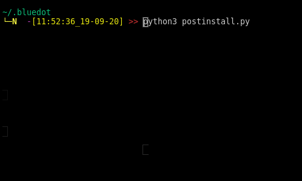

# postinstall

A post linux install script 

## Under development

The config.toml is self explanatory.
I've tried to keep the dependencies and program as simple as possible
and there is no gurantee "SUCCESS" status means the program has installed successfully

## screenshot

## TODO

- [ ] add more exception handling 
- [x] deploy dotfiles with config.toml
- [x] add logging
- [ ] need some kind of validation to make sure the program has installed successfully 
