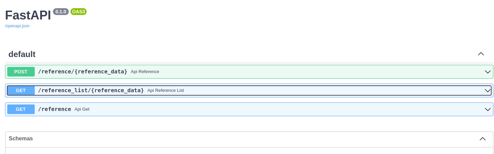
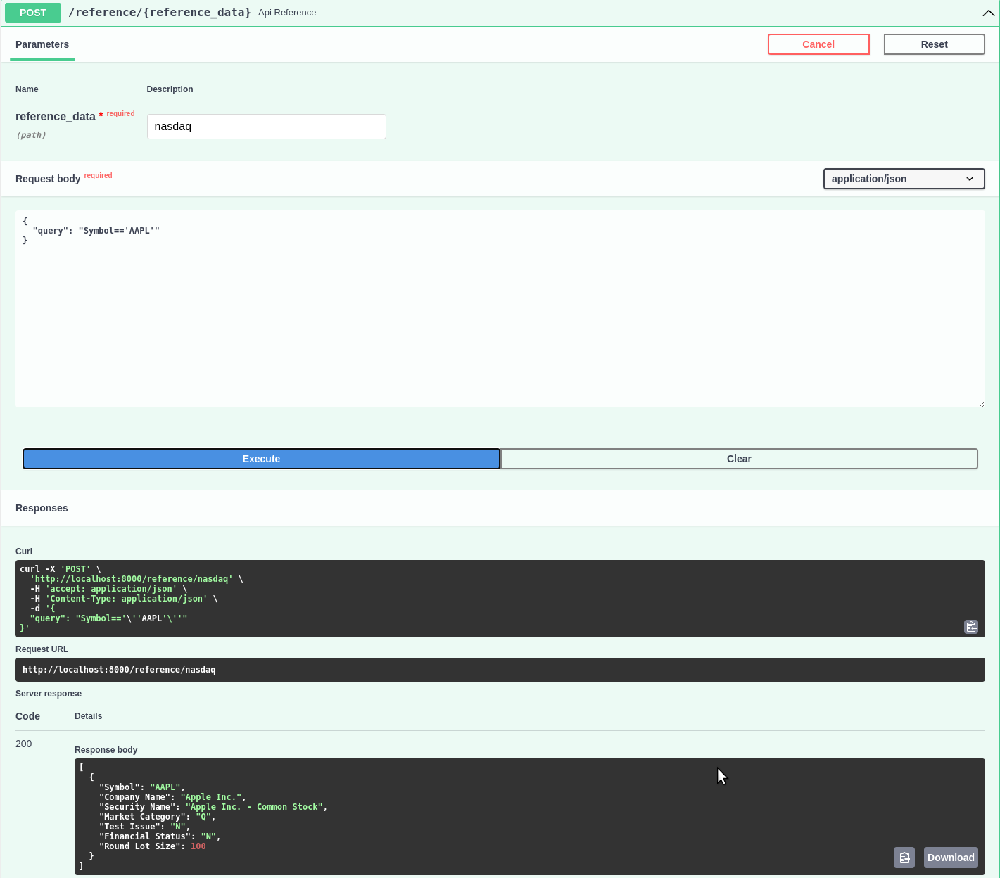
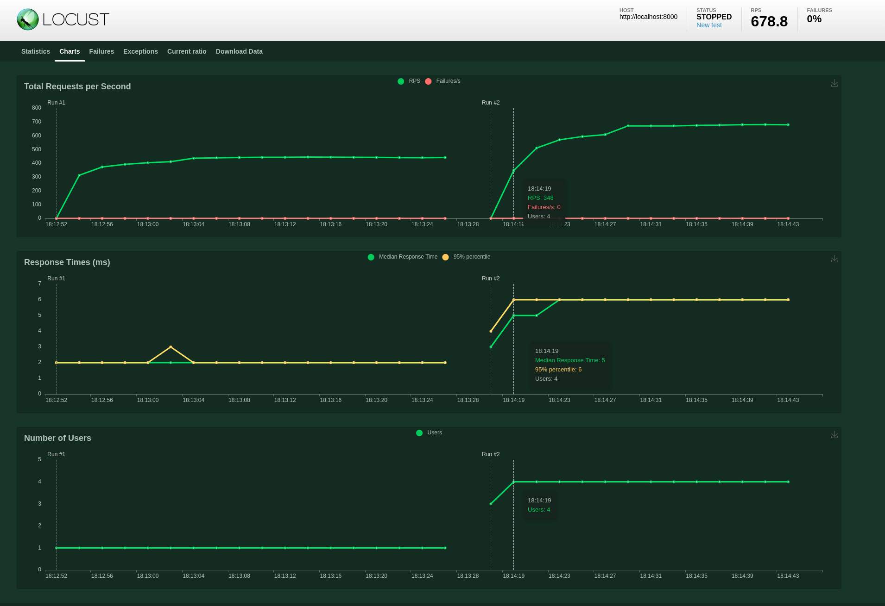

# Serving in memory reference data with FastAPI

A proof concept project for using [pandas query](https://pandas.pydata.org/docs/reference/api/pandas.DataFrame.query.html) to query reference data with REST API.


## To run the project

1. Install poetry
2. After moving into project's root directory run the command `poetry shell`
3. `poetry install` to install the dependencies
4. `python src/app.py` and open `http://localhost:8000/docs` to explore the API.

## Configuration

The project's data folder has CSV documents which acts as a reference data and is loaded based on the `config.json` file where endpoints with path to fetch the CSV document is specified.

The query from POST request is run on these CSV documents which are loaded as pandas dataframe.






## Locust test

```
locust -f misc/locustfile.py 
```

> Number of users 1 with 1 user started/second 

> vs

> Number of users 4 with 1 user started/second

