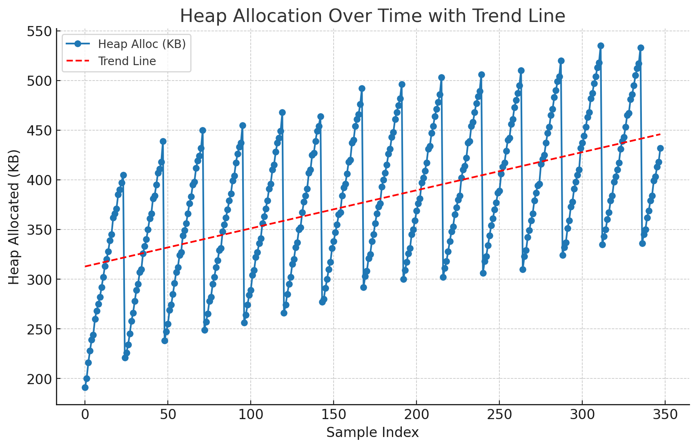

# gocron-heap-observation

A small Go experiment that logs heap memory usage over time and forces garbage collection periodically.

## Overview
This experiment uses `go-co-op/gocron` to:
- Schedule dummy tasks at varying intervals
- Log Go runtime memory stats to `memory_stats.csv` every 5 seconds
- Force a GC cycle every 2 minutes

## Usage
```bash
go run main.go
```
Press `Ctrl+C` to stop.

## Observation
Despite calling `runtime.GC()`, the heap allocation shows an overall increasing trend over time:



---
Just a quick experiment in Go memory behavior.
