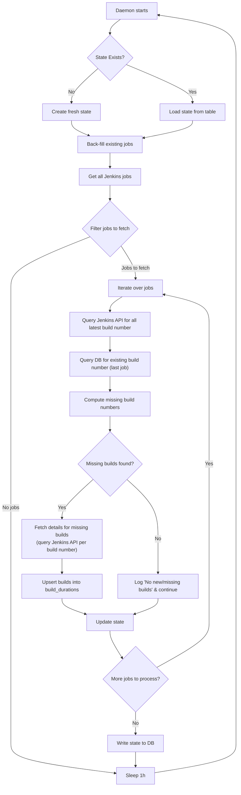

## Thesis

Tracking per-job build duration in Jenkins like a time-series data provides a uniquely valuable and granular level of pipeline observability, enabling effective anomaly detection and a comprehensive understanding of pipeline health beyond traditional system metrics. 

## A Technical Review

This document reviews the technical journey of implementing Jenkins pipeline observability, analyzing the evolution from OpenTelemetry-based metrics to a PostgreSQL-based solution for build duration monitoring. The analysis validates the architectural decisions made and provides recommendations for future implementation.

1. Initial Approach: OpenTelemetry (OTel) Plugin for Jenkins
    - Outcome: Limited success, Too much transformation required to get the build duration per job data from traces.
    - The Jenkins OpenTelemetry plugin is primarily designed for high-level pipeline observability and distributed tracing. While it provides valuable insights into pipeline execution flows, it lacks specific support for retrieving detailed build duration metrics for individual Jenkins jobs. The plugin focuses on:
        - Overall pipeline health metrics
        - Distributed tracing across pipeline stages
        - Security and access monitoring
        - General system performance indicators
    - Requires multiple config changes at trace side to store traces for more than half hour and this shouldn't need compaction to run every few hours.
        - Maybe this is configurable.
2. Secondary Attempt: Attempted to combine Jenkins Metrics plugin with custom OpenTelemetry instrumentation
    - Outcome: Failed due to fundamental data model mismatch
    - Use the Jenkins Metrics plugin to generate build-duration metrics, then export to OTel.
    - Why it didn't work:
        - I tried to use a gauge (e.g., build_duration{job="jobX", build="123"}), but gauges aggregate over time (e.g., Prometheus averages the latest value, not storing individual points).
        - The misconception was that build duration as treated as a metric, but rather an event, a single data point per build. Metrics represent aggregated state, not raw event data. Logs are more suitable (For example: `event_emitter`)
    - Metrics (gauges, histograms) are stateful—they represent the current state (e.g., "last build duration") or aggregated values (e.g., "95th percentile of all builds").
3. Third attempt: Storing Raw Build Events in PostgreSQL
    - Outcome: Successful - meets all requirements for granular build duration tracking
    - This solution succeeds because it aligns with the correct data archetype:
        - Simplicity
        - Each build becomes a discrete record with all associated metadata
        - SQL enables complex queries across multiple dimensions (job, pipeline, time range, build number)
        - Proper indexing supports efficient queries across large datasets
    - Use a custom script to write each build’s duration as a row into PostgreSQL (with columns: build_id, job_name, duration_seconds, timestamp).
    - Visualize in Grafana using PostgreSQL as a data source

## Jenkins Sentinel

### Flow

### Data model

- build_queue
    - id
    - job_path
    - build_number
    - last_attempt_at
    - error_message
    - collection_time (TIMESTAMP WITH TIME ZONE): When this build's data was captured/collected by the daemon.
    - collection_status (ENUM: 'complete', 'partial', 'error', 'pending'): 'Partial' for builds collected mid-run; 'pending' for known but uncollected builds during backfill.

- build_table (This stores the per-build metrics. Primary key: (pipeline_name, build_number) for uniqueness)
    - pipeline_name (VARCHAR(255), part of PK): Unique identifier for the Jenkins pipeline/job.
    - build_number (INTEGER, part of PK): Sequential build ID from Jenkins.
    - build_start_time (TIMESTAMP WITH TIME ZONE): When the build began (from Jenkins API).
    - build_end_time (TIMESTAMP WITH TIME ZONE): When the build completed/aborted.
    - status (ENUM: 'success', 'failure', 'aborted', 'unstable', 'not_built', etc.): Matches Jenkins statuses.
    - total_duration (INTERVAL or DOUBLE PRECISION in seconds): Build runtime. Use INTERVAL for human-readable queries, or seconds for easy math/ML.
    - steps_successful (INTEGER): Count of successful steps/stages.
    - steps_failed (INTEGER): Count of failed steps/stages. (Consider adding steps_total = steps_successful + steps_failed for completeness.)
    - steps_skipped (INTEGER, optional addition): If your pipelines have conditional steps, this could track skipped ones for deeper analysis.
    - last_updated (TIMESTAMP WITH TIME ZONE): When this record was last modified (auto-updated via trigger). Useful for auditing changes.
    - error_log (TEXT): Any errors from Jenkins API during collection (e.g., "API timeout"). Null if successful.

### Reliability & Resilience considerations

- The system should be designed to handle Jenkins restarts or downtime. It remembers the last processed build ID and resumes from there when Jenkins is back online. 
- The system should recover from collector crashes. A "state table" can ensure that only new builds are ingested upon restart, preventing data duplication.
- Should handle scenarios where builds might have the same ID (though rare). The system can leverage timestamps to resolve conflicts.
- A backfilling utility to resync data if the state table gets corrupted or is missing.
- Handle possibility of Jenkins rate limiting. 
- Handle archival for later data analytics.
- For data retention implement automated cleanup policies for historical build data
- Acknowledge the possibility of changes in the Jenkins API and ensure a degree of abstraction in the code to mitigate impact.
- Consider time-series specific PostgreSQL extensions (TimescaleDB)
- Hybrid approach of using Tempo for traces and Postgres for events.

## Troublehsoot

`org.jenkinsci.plugins.durabletask.BourneShellScript.LAUNCH_DIAGNOSTICS=true` for diagnostics.
Can be executed in Jenkins's script console.

## References

- https://github.com/jenkinsci/opentelemetry-plugin/issues/1159
- https://opentelemetry.io/docs/concepts/signals/metrics/
    - "Unlike request tracing, which is intended to capture request lifecycles and provide context to the individual pieces of a request, metrics are intended to provide statistical information in aggregate."
    - Gauge: Measures a current value at the time it is read. An example would be the fuel gauge in a vehicle. Gauges are synchronous.
    - Histogram: A client-side aggregation of values, such as request latencies. A histogram is a good choice if you are interested in value statistics. For example: How many requests take fewer than 1s?