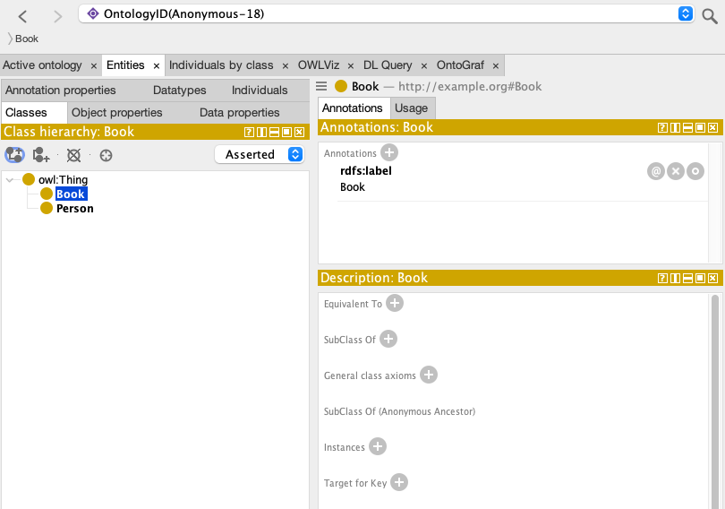
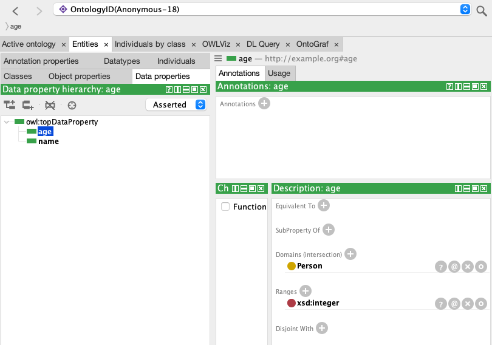
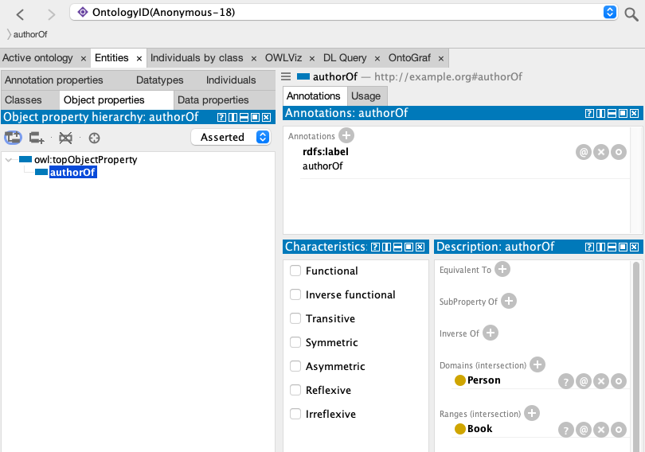

This is an experimentation to try and see how well pydantic can be used to create ontologies. This is barely compliant with OWL API but has some support for creating basic object properties, data properties, classes and sub-classes.

There's no option to add the individuals of the classes and assign those properties yet although that'd be nice!.

