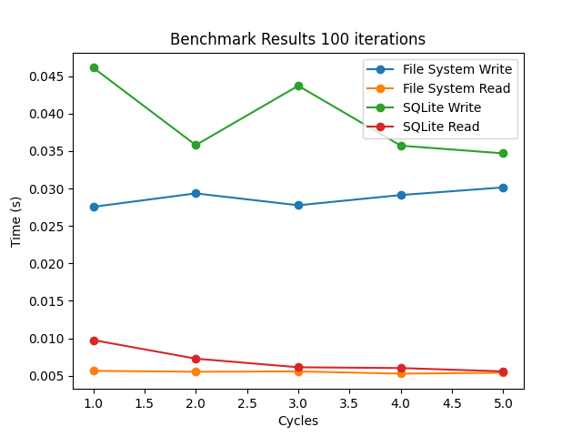
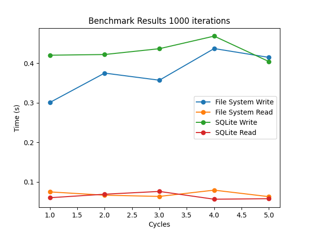
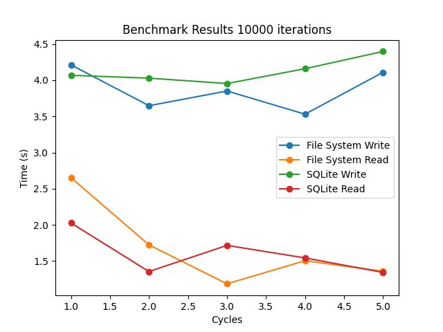

## Benchmark read/write in SQLite vs simple file storage

### Observations

In the first run, writing to SQLite took approximately 4.43 seconds, while writing to the file system took about 2.74 seconds. In subsequent runs, the time taken to write to SQLite decreased to around 3.76 seconds, while the time taken to write to the file system remained relatively constant at around 2.7 seconds. This suggests that SQLite's performance improves with repeated use, possibly due to caching or other optimization mechanisms.

The read operations from the file system were initially slower than from SQLite, taking about 2.24 seconds compared to SQLite's 1.48 seconds. However, in subsequent runs, the time taken to read from the file system decreased dramatically to around 0.43 seconds, while the time taken to read from SQLite remained relatively constant at around 1.2 seconds. This suggests that the file system also employs some form of caching, which significantly improves read performance after the first access.

While SQLite provides faster write operations, especially for bulk inserts, the file system can provide faster read operations after initial access, likely due to caching mechanisms. The choice between the two would therefore depend on the specific requirements of the application, such as whether it performs more write or read operations, and whether it can benefit from the bulk insert capabilities of SQLite's `executemany()` function.

> Note: The text file provided here is from this [wikipedia page](https://en.wikipedia.org/wiki/India)

### Images





#### Hardware config

```
Model Name: MacBook Air
Chip: Apple M2
Total Number of Cores: 8 (4 performance and 4 efficiency)
Memory: 8 GB
OS Loader Version: 10151.101.3
```

> 10,000 files

```
❯ python benchmark.py --iterations=10000 --filename=text
write_file_system took 2.82395601272583 seconds
read_file_system took 2.35856294631958 seconds
write_sqlite took 3.9596030712127686 seconds
read_sqlite took 1.4083750247955322 seconds
Cleaning up files

❯ python benchmark.py --iterations=10000 --filename=text
write_file_system took 2.7931108474731445 seconds
read_file_system took 1.1529982089996338 seconds
write_sqlite took 3.9521119594573975 seconds
read_sqlite took 1.3336472511291504 seconds
Cleaning up files

❯ python benchmark.py --iterations=10000 --filename=text
write_file_system took 2.742954969406128 seconds
read_file_system took 0.8730340003967285 seconds
write_sqlite took 3.9672093391418457 seconds
read_sqlite took 1.096893072128296 seconds
Cleaning up files

❯ python benchmark.py --iterations=10000 --filename=text
write_file_system took 2.7418599128723145 seconds
read_file_system took 0.6525540351867676 seconds
write_sqlite took 3.974774122238159 seconds
read_sqlite took 1.1827456951141357 seconds
Cleaning up files
```

> 20,000 files

```
❯ python benchmark.py --iterations=20000 --filename=text
write_file_system took 5.601946115493774 seconds
read_file_system took 5.844051837921143 seconds
write_sqlite took 23.756388187408447 seconds
read_sqlite took 3.4474239349365234 seconds
Cleaning up files

❯ python benchmark.py --iterations=20000 --filename=text
write_file_system took 5.951803922653198 seconds
read_file_system took 6.061838150024414 seconds
write_sqlite took 27.041829109191895 seconds
read_sqlite took 3.5959792137145996 seconds
Cleaning up files

❯ python benchmark.py --iterations=20000 --filename=text
write_file_system took 5.795745611190796 seconds
read_file_system took 6.220405101776123 seconds
write_sqlite took 33.245250940322876 seconds
read_sqlite took 5.212152719497681 seconds
Cleaning up files
```

